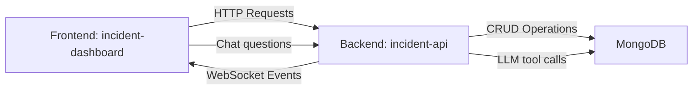

# Incident Management System

This repository contains a **full-stack Incident Management System** composed of two main projects:

1. **`incident-api`**: A backend service built with Node.js, Express, and MongoDB to manage incident data.
2. **`incident-dashboard`**: A frontend application built with React, TypeScript, and Vite to visualize and manage incidents.

---

## 🚀 Overview

This system allows users to:

- **Create, read, update, and delete incidents** via a RESTful API.
- **Visualize and manage incidents** through a modern, responsive dashboard.
- **Filter and view incident details** in a user-friendly interface.
- **Query and create incidents using natural language** via an AI-powered chat assistant integrated in the dashboard.
- **Real-time updates** across all connected clients using WebSockets.

The architecture follows **best practices** for scalability, maintainability, and separation of concerns.

---

## 📁 Project Structure

```txt
/
├── incident-api/          # Backend service (Node.js + Express + MongoDB)
├── incident-dashboard/    # Frontend application (React + TypeScript + Vite)
└── README.md              # Project documentation (this file)
```

---

## 🛠️ Technologies

### Backend (`incident-api`)

- **Runtime**: Node.js
- **Framework**: Express
- **Database**: MongoDB (Mongoose ODM)
- **Language**: TypeScript
- **Libraries**: `Socket.io`, `Zod`, `Helmet`, `express-rate-limit`
- **Development Tools**: `ts-node-dev`, `TypeScript`, `dotenv`, `cors`

### Frontend (`incident-dashboard`)

- **Framework**: React
- **Language**: TypeScript
- **Build Tool**: Vite
- **Styling**: SCSS + CSS Modules
- **State Management**: React Query
- **Routing**: React Router DOM
- **UI Components**: Lucide React (icons)
- **Real-time**: Socket.io-client
- **Package Manager**: pnpm

---

## 🔗 Architecture & Data Flow

The system follows a **decoupled architecture** where the frontend communicates with the backend via a RESTful API.



### Data Flow

1. The **frontend** sends HTTP requests to the **backend API**.
2. The **backend** processes the requests, interacts with the **database**, and returns responses.
3. The **frontend** displays the data and allows users to interact with it.
4. The **chat assistant** (floating panel in the dashboard) sends questions to `/api/chat/query`; the backend queries the LLM and returns a natural-language answer plus optional structured filters that are applied automatically to the incident list. The assistant can also create new incidents on behalf of the user.
5. **Real-time updates** are broadcasted via WebSockets whenever an incident is created, updated, or deleted, keeping all connected clients in sync.

### API Endpoints

The backend exposes the following endpoints under the `/api` prefix:

| Method | Endpoint                   | Description                  |
| ------ | -------------------------- | ---------------------------- |
| GET    | `/api/incidents`           | Retrieve all incidents       |
| GET    | `/api/incidents/assignees` | Retrieve all assignees       |
| GET    | `/api/incidents/:id`       | Retrieve a specific incident |
| POST   | `/api/incidents`           | Create a new incident        |
| PUT    | `/api/incidents/:id`       | Update an existing incident  |
| DELETE | `/api/incidents/:id`       | Delete an incident           |
| POST   | `/api/chat/query`          | Ask the AI assistant         |
| GET    | `/health`                  | Health check                 |

For more details, check the [Backend README](./incident-api/README.md).

---

## 📂 Domain Model

### Incident

An **incident** represents an issue that needs to be tracked and resolved. It has the following properties:

| Field         | Type               | Description                                       |
| ------------- | ------------------ | ------------------------------------------------- |
| `id`          | `string`           | Unique identifier                                 |
| `title`       | `string`           | Short description of the incident                 |
| `description` | `string`           | Detailed description                              |
| `status`      | `IncidentStatus`   | Current state (`open`, `in progress`, `resolved`) |
| `priority`    | `IncidentPriority` | Severity level (`low`, `medium`, `high`)          |
| `assignee`    | `string`           | Person responsible for the incident               |
| `createdAt`   | `Date`             | When the incident was created                     |

---

## 🚀 Getting Started

### Prerequisites

- **Node.js** (v22 or later)
- **pnpm** (v9 or later)
- **MongoDB Atlas** (or a local MongoDB instance)
- **Docker Desktop** (optional, for running the project in containers)

### Environment Variables

#### Backend Variables (`incident-api`)

| Variable       | Description                  | Example                                      |
| -------------- | ---------------------------- | -------------------------------------------- |
| `PORT`         | Port for the backend server  | `3000`                                       |
| `MONGODB_URI`  | URI for MongoDB connection   | `mongodb://localhost:27017/incident_db`      |
| `LLM_API_KEY`  | API key for the LLM provider | `your_llm_api_key_here`                      |
| `LLM_MODEL`    | Model name to use            | `mistral-small-latest`                       |
| `LLM_BASE_URL` | Base URL for the LLM API     | `https://api.mistral.ai/v1/chat/completions` |
| `LLM_PROVIDER` | LLM provider identifier      | `mistral`                                    |

Copy `.env.example` as a starting point: `cp incident-api/.env.example incident-api/.env`

#### Frontend Variables (`incident-dashboard`)

| Variable       | Description                 | Example                     |
| -------------- | --------------------------- | --------------------------- |
| `VITE_API_URL` | Base URL of the backend API | `http://localhost:3000/api` |

> ⚠️ `VITE_API_URL` must include the `/api` suffix. The frontend services append `/incidents` and `/chat` to this value.

---

### Setup

#### 1. Clone the repository

```bash
git clone https://github.com/YOUR_USERNAME/incident-management-system.git
cd incident-management-system
```

#### 2. Set up the Backend (`incident-api`)

```bash
cd incident-api
pnpm install
cp .env.example .env   # then fill in your values
```

Start the backend:

```bash
pnpm dev
```

The API will be available at `http://localhost:3000`.

For more details, check the [Backend README](./incident-api/README.md).

---

#### 3. Set up the Frontend (`incident-dashboard`)

```bash
cd ../incident-dashboard
pnpm install
```

Create a `.env` file in the `incident-dashboard` directory:

```env
VITE_API_URL=http://localhost:3000/api
```

Start the frontend:

```bash
pnpm dev
```

The dashboard will be available at `http://localhost:5173`.

For more details, check the [Frontend README](./incident-dashboard/README.md).

---

### 🐳 Running with Docker

The project includes full Docker support. Both services are containerized and can be started with a single command.

#### Requirements

- **Docker Desktop** installed and running.

#### Environment setup

Create a `.env` file at the **project root** with the frontend API URL:

```env
VITE_API_URL=http://localhost:3000/api
```

Create `incident-api/.env` from the example and fill in your values (see [Backend README](./incident-api/README.md)):

```bash
cp incident-api/.env.example incident-api/.env
```

#### Start all services

```bash
docker compose up --build
```

This builds and starts:

| Service   | URL                     | Description                    |
| --------- | ----------------------- | ------------------------------ |
| Dashboard | <http://localhost:8080> | React frontend served by Nginx |
| API       | <http://localhost:3000> | Node.js/Express backend        |

> The API connects to your MongoDB Atlas cluster configured in `incident-api/.env`. No local MongoDB container is used.

To stop all services:

```bash
docker compose down
```

---

## 🧪 Testing

Testing is a **planned feature** for this project. Both the **backend** and **frontend** will soon include:

### Backend Testing (`incident-api`)

- **Unit tests** for controllers and services.
- **Integration tests** for API endpoints.
- **Test coverage** to ensure reliability.

### Frontend Testing (`incident-dashboard`)

- **Unit tests** for components and hooks.
- **Component tests** using React Testing Library.
- **Integration tests** for API interactions and user flows.

---

## 📌 Best Practices

### Backend

- **Separation of concerns**: Routes, controllers, and models are decoupled.
- **Type safety**: TypeScript is used for all layers.
- **RESTful design**: API follows REST conventions.
- **Environment variables**: Sensitive configuration is managed via `.env`.

### Frontend

- **Feature-based architecture**: Code is organized by domain (e.g., `incidents`, `chat`).
- **Reusable components**: UI components are modular and typed.
- **CSS Modules**: Styles are scoped to components.
- **Decoupled data access**: Services handle API communication.
- **Strong typing**: TypeScript ensures type safety across the application.

---

## 🛠️ Future Improvements

- **Authentication**: Add user authentication (e.g., JWT).

---

## 👤 Author

Jose A. Cantó (JackDev)

- GitHub: [@JackDev21](https://github.com/JackDev21)
- LinkedIn: [Jose A. Cantó](https://www.linkedin.com/in/joseaclopez/)
