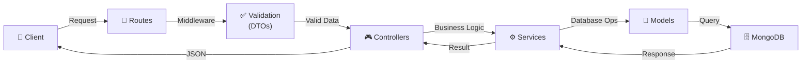

# Incident API

**Backend service for the Incident Management System**, built with **Node.js**, **Express**, and **MongoDB**. This API provides a RESTful interface for managing incidents, as well as an AI-powered chat endpoint.

For more details about the overall project, check the [Root README](../README.md).

---

## 🚀 Overview

This API is designed to:

- **Store and manage incident data** in a MongoDB database.
- **Provide a RESTful interface** for frontend applications (e.g., `incident-dashboard`).
- **Answer natural language questions and create incidents** via an AI chat assistant with tool calling.
- **Provide real-time updates** to connected clients using WebSockets.
- **Ensure type safety and data validation** with TypeScript and Zod.
- **Protect against abuse** with rate limiting and security headers.
- **Follow best practices** for scalability and maintainability.

---

## 🛠️ Technologies

- **Runtime**: Node.js
- **Framework**: Express
- **Database**: MongoDB (Mongoose ODM)
- **Language**: TypeScript
- **Libraries**:
  - `Socket.io` (real-time updates)
  - `Zod` (request validation)
  - `Helmet` (security headers)
  - `express-rate-limit` (rate limiting)
- **Development Tools**:
  - `ts-node-dev` (hot reloading)
  - `TypeScript` (type safety)
  - `dotenv` (environment variables)
  - `cors` (cross-origin resource sharing)
  - `Jest` + `ts-jest` (unit and integration testing)
  - `Supertest` (HTTP endpoint testing)

---

## 📂 Project Structure

```txt
incident-api/
├── src/
│   ├── config/
│   │   └── db.ts                           # Database connection
│   ├── middleware/
│   │   ├── errorHandler.ts                 # Global error handling, asyncHandler, validateRequest
│   │   └── index.ts                        # Middleware exports (requestLogger, notFound)
│   ├── modules/
│   │   ├── incidents/
│   │   │   ├── dtos/
│   │   │   │   └── create-incident.dto.ts  # Validation DTOs
│   │   │   ├── incident.controller.ts      # Request handlers
│   │   │   ├── incident.model.ts           # Mongoose schema
│   │   │   ├── incident.routes.ts          # API routes
│   │   │   ├── incident.service.ts         # Business logic
│   │   │   ├── incident.types.ts           # TypeScript types
│   │   │   └── index.ts                    # Module exports
│   │   ├── chat/
│   │   │   ├── chat.controller.ts          # Chat request handler
│   │   │   ├── chat.routes.ts              # Chat routes
│   │   │   ├── chat.service.ts             # LLM integration + tool calling
│   │   │   └── index.ts                    # Module exports
│   │   └── index.ts                        # Modules exports
│   ├── types/
│   │   └── common.types.ts                 # Global types (ApiResponse, PaginatedResponse)
│   ├── utils/
│   │   └── responses.ts                    # Response helpers (sendSuccess, sendError)
│   └── index.ts                            # Entry point
├── .env.example                            # Environment variables template
├── package.json                            # Project dependencies
├── tsconfig.json                           # TypeScript configuration
└── README.md                               # This file
```

---

## 🔌 API Endpoints

All routes are served under the `/api` prefix.

### Incidents

| Method | Endpoint                   | Description                  | Request Body (JSON)                                       |
| ------ | -------------------------- | ---------------------------- | --------------------------------------------------------- |
| GET    | `/api/incidents`           | Retrieve all incidents       | N/A                                                       |
| GET    | `/api/incidents/assignees` | Retrieve all assignees       | N/A                                                       |
| GET    | `/api/incidents/:id`       | Retrieve a specific incident | N/A                                                       |
| POST   | `/api/incidents`           | Create a new incident        | `{ title, description, priority, assignee }`              |
| PUT    | `/api/incidents/:id`       | Update an existing incident  | `{ title?, description?, status?, priority?, assignee? }` |
| DELETE | `/api/incidents/:id`       | Delete an incident           | N/A                                                       |

> `GET /api/incidents` supports optional query parameters: `?status=`, `?priority=`, `?assignee=`. The `assignee` filter is case-insensitive (`lorena` matches `Lorena`).

### Chat

| Method | Endpoint          | Description                          | Request Body (JSON)      |
| ------ | ----------------- | ------------------------------------ | ------------------------ |
| POST   | `/api/chat/query` | Ask the AI assistant about incidents | `{ question, history? }` |

### Health

| Method | Endpoint  | Description  |
| ------ | --------- | ------------ |
| GET    | `/health` | Health check |

---

### Example Requests

#### **Create an Incident**

```http
POST /api/incidents
Content-Type: application/json

{
  "title": "Server Down",
  "description": "The main application server is not responding.",
  "priority": "high",
  "assignee": "John Doe"
}
```

Response:

```json
{
  "success": true,
  "data": {
    "id": "65a1e4b3c8d6a1b2c3d4e5f6",
    "title": "Server Down",
    "description": "The main application server is not responding.",
    "status": "open",
    "priority": "high",
    "assignee": "John Doe",
    "createdAt": "2024-01-12T10:00:00.000Z"
  },
  "message": "Incident created successfully"
}
```

Validation error:

```json
{
  "success": false,
  "error": "Title is required and must be a non-empty string"
}
```

#### **Ask the Chat Assistant**

```http
POST /api/chat/query
Content-Type: application/json

{
  "question": "How many high priority incidents are open?",
  "history": [
    { "role": "user", "content": "Show incidents assigned to Ana" },
    { "role": "assistant", "content": "There are 3 incidents assigned to Ana." }
  ]
}
```

Response:

```json
{
  "success": true,
  "data": {
    "answer": "There are 2 open high-priority incidents.",
    "appliedFilters": {
      "status": "open",
      "priority": "high"
    }
  },
  "message": "Answer generated successfully"
}
```

The `appliedFilters` field is returned when the assistant queries incidents using specific criteria. The frontend uses this to automatically sync the list filters.

> **Chat assistant behavior:**
>
> - Assignee search is **case-insensitive** and **accent-insensitive** (`"lorena"` matches `"Lorena García"`).
> - If a partial name matches **multiple distinct assignees**, the assistant will list them and ask the user to clarify before answering.
> - The assistant can **create incidents** if the user provides the required information (title, description, priority, assignee). If information is missing, it will ask for it.

---

## 📂 Domain Model

### Incident

| Field         | Type               | Description                                       | Required | Default Value  |
| ------------- | ------------------ | ------------------------------------------------- | -------- | -------------- |
| `id`          | `string`           | Unique identifier                                 | No       | Auto-generated |
| `title`       | `string`           | Short description of the incident                 | Yes      | N/A            |
| `description` | `string`           | Detailed description                              | Yes      | N/A            |
| `status`      | `IncidentStatus`   | Current state (`open`, `in progress`, `resolved`) | No       | `open`         |
| `priority`    | `IncidentPriority` | Severity level (`low`, `medium`, `high`)          | Yes      | N/A            |
| `assignee`    | `string`           | Person responsible for the incident               | Yes      | N/A            |
| `createdAt`   | `Date`             | When the incident was created                     | No       | Current date   |

---

## 🚀 Getting Started

### Prerequisites

- **Node.js** (v22 or later)
- **pnpm** (v9 or later)
- **MongoDB Atlas** (or a local MongoDB instance)

### Environment Variables

| Variable       | Description                  | Example                                      |
| -------------- | ---------------------------- | -------------------------------------------- |
| `PORT`         | Port for the backend server  | `3000`                                       |
| `MONGODB_URI`  | URI for MongoDB connection   | `mongodb://localhost:27017/incident_db`      |
| `JWT_SECRET`   | Secret used to sign JWTs     | `replace_with_a_long_random_secret`          |
| `LLM_API_KEY`  | API key for the LLM provider | `your_llm_api_key_here`                      |
| `LLM_MODEL`    | Model to use                 | `mistral-small-latest`                       |
| `LLM_BASE_URL` | LLM API base URL             | `https://api.mistral.ai/v1/chat/completions` |
| `LLM_PROVIDER` | LLM provider identifier      | `mistral`                                    |

> `JWT_SECRET` is required for any authenticated flow. The API now starts in strict mode and will fail fast if it is missing.
>
> `LLM_API_KEY` is required for the `/api/chat/query` endpoint. The rest of the LLM vars have defaults set in the service.

### Setup

```bash
cd incident-api
pnpm install
cp .env.example .env   # fill in MONGODB_URI and LLM_API_KEY at minimum
pnpm dev
```

The API will be available at `http://localhost:3000`.

---

## 🧪 Testing

Testing is fully configured and currently covers DTOs, services, routes, middleware, database config, and shared utilities.

- **Test runner**: `Jest` with `ts-jest`
- **HTTP tests**: `Supertest`
- **Scripts**:
  - `pnpm test`
  - `pnpm test:watch`
  - `pnpm test:coverage`

To run tests:

```bash
cd incident-api
pnpm test
```

To generate the HTML coverage report:

```bash
cd incident-api
pnpm test:coverage
```

Coverage report output:

- `coverage/lcov-report/index.html`

---

## 📌 Best Practices

- **Separation of concerns**: Routes, controllers, services, and models are properly decoupled.
- **Validation layer**: Input data (body and query parameters) is validated using Zod schemas before processing.
- **Centralized error handling**: All errors are caught by a global middleware.
- **Security**: Helmet is used for security headers, and express-rate-limit protects against DoS attacks and LLM API abuse.
- **Real-time**: Socket.io is used to broadcast incident changes to connected clients, with connection and message rate limiting.
- **Type safety**: TypeScript is used for all layers with explicit interfaces.
- **RESTful design**: API follows REST conventions (201 on create, 204 on delete).
- **Environment variables**: Sensitive configuration is managed via `.env`.
- **Service layer**: Business logic is separated from controllers.

---

## 🛠️ Future Improvements

- **Authentication**: Add JWT-based authentication for secure endpoints.
- **Swagger/OpenAPI**: Add API documentation using Swagger or OpenAPI.
- **Structured Logging**: Expand structured logging for production monitoring.
- **CI Automation**: Add CI pipeline checks for tests and coverage thresholds.

---

## 🔗 Architecture



### Flow Description

1. **Routes**: Receive HTTP requests and route to appropriate handlers
2. **Middleware**: Validate input data using DTOs before processing
3. **Controllers**: Handle requests and call service methods
4. **Services**: Contain all business logic and database operations
5. **Models**: Define MongoDB schemas and queries
6. **MongoDB**: Store and retrieve incident data

---

## 👤 Author

Jose A. Cantó (JackDev)

- GitHub: [@JackDev21](https://github.com/JackDev21)
- LinkedIn: [Jose A. Cantó](https://www.linkedin.com/in/joseaclopez/)
