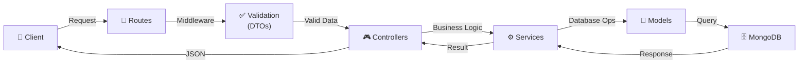

# Incident API

**Backend service for the Incident Management System**, built with **Node.js**, **Express**, and **MongoDB**. This API provides a RESTful interface for managing incidents, including creation, retrieval, updating, and deletion.

For more details about the overall project, check the [Root README](../README.md).

---

## 🚀 Overview

This API is designed to:

- **Store and manage incident data** in a MongoDB database.
- **Provide a RESTful interface** for frontend applications (e.g., `incident-dashboard`).
- **Ensure type safety** with TypeScript.
- **Follow best practices** for scalability and maintainability.

---

## 🛠️ Technologies

- **Runtime**: Node.js
- **Framework**: Express
- **Database**: MongoDB (Mongoose ODM)
- **Language**: TypeScript
- **Development Tools**:
  - `ts-node-dev` (hot reloading)
  - `TypeScript` (type safety)
  - `dotenv` (environment variables)
  - `cors` (cross-origin resource sharing)

---

## 📂 Project Structure

```txt
incident-api/
├── src/
│   ├── config/
│   │   └── db.ts                           # Database connection
│   ├── middleware/
│   │   ├── errorHandler.ts                 # Global error handling
│   │   └── index.ts                        # Middleware exports
│   ├── modules/
│   │   ├── incidents/
│   │   │   ├── dtos/
│   │   │   │   └── create-incident.dto.ts  # Validation DTOs
│   │   │   ├── incident.controller.ts      # Request handlers
│   │   │   ├── incident.model.ts           # Mongoose schema
│   │   │   ├── incident.routes.ts          # API routes
│   │   │   ├── incident.service.ts         # Business logic
│   │   │   ├── incident.types.ts           # TypeScript types
│   │   │   └── index.ts                    # Module exports
│   │   └── index.ts                        # Modules exports
│   ├── types/
│   │   └── common.types.ts                 # Global types
│   ├── utils/
│   │   └── responses.ts                    # Response helpers
│   └── index.ts                            # Entry point
├── .env                                    # Environment variables
├── package.json                            # Project dependencies
├── tsconfig.json                           # TypeScript configuration
└── README.md                               # This file
```

---

## 🔌 API Endpoints

The API exposes the following endpoints for incident management:

| Method | Endpoint         | Description                  | Request Body (JSON)                                       |
| ------ | ---------------- | ---------------------------- | --------------------------------------------------------- |
| GET    | `/incidents`     | Retrieve all incidents       | N/A                                                       |
| GET    | `/incidents/:id` | Retrieve a specific incident | N/A                                                       |
| POST   | `/incidents`     | Create a new incident        | `{ title, description, priority, assignee }`              |
| PUT    | `/incidents/:id` | Update an existing incident  | `{ title?, description?, status?, priority?, assignee? }` |
| DELETE | `/incidents/:id` | Delete an incident           | N/A                                                       |

### Example Requests

#### **Create an Incident**

**Request:**

```http
POST /incidents
Content-Type: application/json

{
  "title": "Server Down",
  "description": "The main application server is not responding.",
  "priority": "high",
  "assignee": "John Doe"
}
```

**Response:**

```json
{
  "success": true,
  "data": {
    "id": "65a1e4b3c8d6a1b2c3d4e5f6",
    "title": "Server Down",
    "description": "The main application server is not responding.",
    "status": "open",
    "priority": "high",
    "assignee": "John Doe",
    "createdAt": "2024-01-12T10:00:00.000Z"
  },
  "message": "Incident created successfully"
}
```

**Validation Error Response:**

```json
{
  "success": false,
  "error": "Title is required and must be a non-empty string"
}
```

#### **Get All Incidents**

**Request:**

```http
GET /incidents
```

**Response:**

```json
{
  "success": true,
  "data": [
    {
      "id": "65a1e4b3c8d6a1b2c3d4e5f6",
      "title": "Server Down",
      "description": "The main application server is not responding.",
      "status": "open",
      "priority": "high",
      "assignee": "John Doe",
      "createdAt": "2024-01-12T10:00:00.000Z"
    },
    {
      "id": "65a1e4b3c8d6a1b2c3d4e5f7",
      "title": "Database Connection Failed",
      "description": "Unable to connect to the database.",
      "status": "in progress",
      "priority": "medium",
      "assignee": "Jane Smith",
      "createdAt": "2024-01-11T09:00:00.000Z"
    }
  ],
  "message": "Incidents retrieved successfully"
}
```

---

## 📂 Domain Model

### Incident

An **incident** represents an issue that needs to be tracked and resolved. It has the following properties:

| Field         | Type               | Description                                       | Required | Default Value  |
| ------------- | ------------------ | ------------------------------------------------- | -------- | -------------- |
| `id`          | `string`           | Unique identifier                                 | No       | Auto-generated |
| `title`       | `string`           | Short description of the incident                 | Yes      | N/A            |
| `description` | `string`           | Detailed description                              | Yes      | N/A            |
| `status`      | `IncidentStatus`   | Current state (`open`, `in progress`, `resolved`) | No       | `open`         |
| `priority`    | `IncidentPriority` | Severity level (`low`, `medium`, `high`)          | Yes      | N/A            |
| `assignee`    | `string`           | Person responsible for the incident               | Yes      | N/A            |
| `createdAt`   | `Date`             | When the incident was created                     | No       | Current date   |

---

## 🚀 Getting Started

### Prerequisites

- **Node.js** (v20 or later)
- **pnpm** or **npm**
- **MongoDB** (running locally or via a cloud service like MongoDB Atlas)

### Environment Variables

| Variable      | Description                 | Example                                 |
| ------------- | --------------------------- | --------------------------------------- |
| `PORT`        | Port for the backend server | `3000`                                  |
| `MONGODB_URI` | URI for MongoDB connection  | `mongodb://localhost:27017/incident_db` |

---

### Setup

#### 1. Clone the repository

```bash
 git clone https://github.com/YOUR_USERNAME/incident-management-system.git
 cd incident-management-system/incident-api
```

#### 2. Install dependencies

```bash
 pnpm install
```

#### 3. Configure environment variables

Create a `.env` file in the root of the `incident-api` directory with the following content:

```env
 PORT=3000
 MONGODB_URI=mongodb://localhost:27017/incident_db
```

#### 4. Start the API

```bash
 pnpm dev
```

The API will be available at `http://localhost:3000`.

---

## 🧪 Testing

Testing is a **planned feature** for this project. The API will soon include:

- **Unit tests** for controllers and services.
- **Integration tests** for API endpoints.
- **Test coverage** to ensure reliability.

---

## 📌 Best Practices

- **Separation of concerns**: Routes, controllers, services, and models are properly decoupled.
- **Validation layer**: Input data is validated using DTOs before processing.
- **Centralized error handling**: All errors are caught by a global middleware.
- **Type safety**: TypeScript is used for all layers with explicit interfaces.
- **RESTful design**: API follows REST conventions.
- **Environment variables**: Sensitive configuration is managed via `.env`.
- **Service layer**: Business logic is separated from controllers.

---

## 🛠️ Future Improvements

- **Authentication**: Add JWT-based authentication for secure endpoints.
- **Pagination**: Implement pagination for the `GET /incidents` endpoint.
- **Filtering and Sorting**: Add query parameters for filtering and sorting incidents.
- **Rate Limiting**: Protect the API from abuse with rate limiting.
- **Swagger/OpenAPI**: Add API documentation using Swagger or OpenAPI.
- **Logging**: Implement structured logging for debugging and monitoring.

---

## 🔗 Architecture



### Flow Description

1. **Routes**: Receive HTTP requests and route to appropriate handlers
2. **Middleware**: Validate input data using DTOs before processing
3. **Controllers**: Handle requests and call service methods
4. **Services**: Contain all business logic and database operations
5. **Models**: Define MongoDB schemas and queries
6. **MongoDB**: Store and retrieve incident data

---

## 👤 Author

Jose A. Cantó (JackDev)

- GitHub: [@JackDev21](https://github.com/JackDev21)
- LinkedIn: [Jose A. Cantó](https://www.linkedin.com/in/joseaclopez/)
