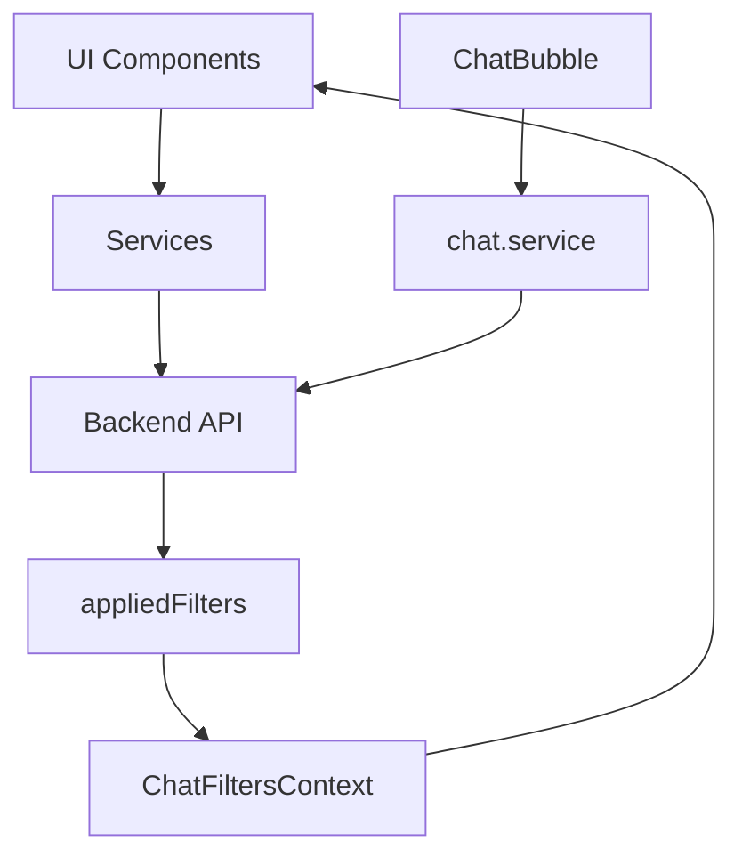

# Incident Dashboard

Frontend application built with **React** and **TypeScript** for the **Incident Management System**. This project provides a modern, responsive interface to visualize and manage incidents, with an integrated AI chat assistant.

For more details about the overall project, check the [Root README](../README.md).

---

## 🚀 Overview

This dashboard is designed to:

- **Visualize incidents** in a user-friendly interface.
- **Interact with the backend API** (`incident-api`) to manage incidents.
- **Filter incidents** by status, priority, and assignee.
- **Query incidents using natural language** via a floating AI chat assistant.
- **Follow best practices** for scalability, maintainability, and separation of concerns.

---

## 🛠️ Technologies

- **Framework**: React 19
- **Language**: TypeScript
- **Build Tool**: Vite
- **Styling**: SCSS + CSS Modules
- **State Management**: React Query
- **Routing**: React Router DOM
- **UI Components**: Lucide React (icons)
- **Package Manager**: pnpm

---

## 📂 Project Structure

The project follows a **feature-based architecture** to ensure scalability and maintainability:

```txt
src/
  app/
    router/             # Route definitions (AppRouter)
  components/
    ui/                 # Reusable UI primitives (Button, Card, Badge, Modal)
    layout/             # App layout and Header
  features/
    incidents/          # Incident domain
      components/       # IncidentCard, IncidentDetail, IncidentFilters, EmptyIncidentState
      hooks/            # useIncidents, useIncidentDetails
      pages/            # IncidentListPage, IncidentDetailPage, CreateIncidentPage
      services/         # incidents.service.ts (API calls)
      types/            # Incident, IncidentStatus, IncidentPriority
      utils/            # incidentBadgeVariants
    chat/               # Chat assistant feature
      components/       # ChatBubble (floating panel)
      context/          # ChatFiltersContext, ChatFiltersProvider, useChatFilters
      hooks/            # useChat
      services/         # chat.service.ts (API calls)
  styles/               # Global styles and variables
```

---

## 🔗 Architecture & Data Flow

The frontend follows a **decoupled architecture** where:

1. **UI Components** (pages, components) interact with **services** to fetch or send data.
2. **Services** communicate with the **backend API** (`incident-api`).
3. **State management** is handled by **React Query** for caching and synchronization.
4. **Chat filters** propagate from chat responses to the incident list via shared context.



---

## 🧩 Key Features

### Incident Management

- **Incident List**: Responsive grid with filtering by status, priority, and assignee.
- **Incident Detail**: Shows full incident info; allows inline status update via dropdown.
- **Create Incident**: Form to report a new incident with title, description, priority, and assignee.
- **Delete Incident**: Delete with confirmation modal to prevent accidental deletion.

### Chat Assistant

A floating chat panel (powered by the backend's LLM integration) is available on every page:

- Ask natural-language questions about incidents (e.g. _"How many high-priority incidents are open?"_).
- Supports conversation history for multi-turn queries.
- **Case-insensitive assignee search**: writing `"lorena"` or `"LORENA"` returns the same results as `"Lorena"`.
- **Disambiguation**: if a name matches multiple distinct assignees, the assistant lists them and asks which one you mean before answering.
- When the assistant uses filters to answer, those filters are automatically applied to the incident list view.
- **New conversation button** (↺ icon in the chat header): clears the conversation history and resets any filters applied by the chat.

### Reusable UI Components

| Component | Description                                       |
| --------- | ------------------------------------------------- |
| `Button`  | Variants: `primary`, `secondary`, `ghost`, `icon` |
| `Card`    | Wrapper with consistent padding and shadow        |
| `Badge`   | Colored label for status/priority display         |
| `Modal`   | Confirmation modal used for destructive actions   |

---

## 🚀 Getting Started

### Prerequisites

- **Node.js** (v22 or later)
- **pnpm** (v9 or later)

### Environment Variables

| Variable       | Description                 | Example                     |
| -------------- | --------------------------- | --------------------------- |
| `VITE_API_URL` | Base URL of the backend API | `http://localhost:3000/api` |

> ⚠️ `VITE_API_URL` must include the `/api` suffix. Services append `/incidents` and `/chat` to this value.

---

### Setup

```bash
cd incident-dashboard
pnpm install
```

Create a `.env` file:

```env
VITE_API_URL=http://localhost:3000/api
```

Start the development server:

```bash
pnpm dev
```

The dashboard will be available at `http://localhost:5173`.

---

## 🧭 Routes

| Path                | Description                |
| ------------------- | -------------------------- |
| `/`                 | Redirects to `/incidents`  |
| `/incidents`        | Incident list with filters |
| `/incidents/create` | Create a new incident      |
| `/incidents/:id`    | Incident detail            |

---

## 🧪 Testing

Testing is a **planned feature** for this project. The frontend will soon include:

- **Unit tests** for components and hooks.
- **Component tests** using React Testing Library.
- **Integration tests** for API interactions and user flows.

---

## 📌 Best Practices

- **Feature-based architecture**: Code is organized by domain (e.g., `incidents`, `chat`).
- **Reusable components**: UI components are modular and typed.
- **CSS Modules**: Styles are scoped to components to avoid global conflicts.
- **Decoupled data access**: Services handle API communication.
- **Strong typing**: TypeScript strict mode ensures type safety across the application.
- **Path alias**: `@/*` maps to `src/*` for clean imports.

---

## 🛠️ Future Improvements

- **Authentication**: Add user authentication (e.g., JWT).
- **Real-time updates**: Use WebSockets or Server-Sent Events (SSE) for live updates.
- **Dark mode**: Implement a dark/light theme toggle.
- **Advanced filtering**: Add robust filtering and sorting options.
- **Pagination**: Implement pagination for incident lists.

---

## 👤 Author

Jose A. Cantó (JackDev)

- GitHub: [@JackDev21](https://github.com/JackDev21)
- LinkedIn: [Jose A. Cantó](https://www.linkedin.com/in/joseaclopez/)
